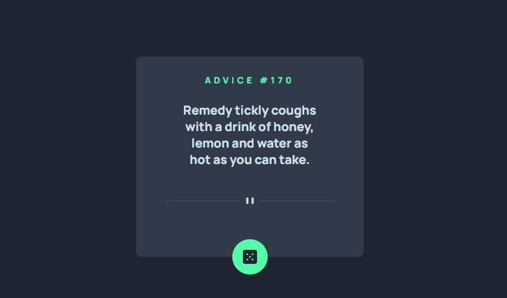

# Frontend Mentor - Advice generator app solution

Esta é uma solução para o [Advice generator app challenge on Frontend Mentor](https://www.frontendmentor.io/challenges/advice-generator-app-QdUG-13db).

### O Desafio

Construir um gerador de conselho:

- Mostrar ao usuário um conselho com o seu respectivo identificador;
- A cada click no botão mostrar um conselho diferente.

### Screenshot

Imagem do projeto []


## Tecnologias utilizadas

- HTML;
- CSS;
- JS.

### O que aprendi

 - Posicionar os elementos na tela;
 - Utilizar fontes externas;
 - Trabalahar com as propriedades do Display Flex;
 - Aplicar efeito hover;
 - Manipular o Dom com o JS;
 - Consumir uma API de conselhos.


### Como utilizar

1 - Clone para o projeto

```
git@github.com:ederhscc/advice-generator-app-main.git
```
## Author

- Linkedin - [Eder Henrique Santos](https://www.linkedin.com/in/eder-henrique-santos/)